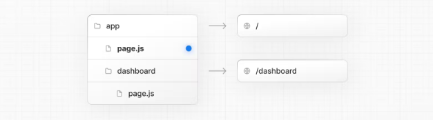

# 1. Defining Routes

Next js는 라우터를 기반으로 하는 파일 시스템을 사용한다. 경로들을 정의하는데 익숙한 폴더들에 있는 라우터들이다.
각 폴더는 url 세그먼트 만드는 라우터 segment를 의미한다. 중첩된 라우트를 만들려면, 너는 각 폴더 안에 중첩된 폴더를 만들면 된다.  
폴더 구조 app / dashboard / settings -> 경로 acme.com/dashboard/settings.

특별한 pages.js파일은 public하게 접근가능한 라우트 세그먼트들을 만드는데 사용한다. = private 하지 않다.

예를 들어 /dashboard/analytics URL 경로는 public하게 접근할 수 없다. 왜냐하면 해당하는 page.js파일이 폴더에 없기 때문이다.
이 폴더는 컴포넌트들, 스타일시트, 이미지, 다른 관련 파일들도 저장한다.
.js, .jsx 또는 .tsx 파일 확장자들이 특정 파일에 사용될 수 있다.

UI 만들기
특정 파일 컨벤션들은 각 라우트 시크먼트에 대한 UI들을 만드는데 익숙하다. 가장 기본적인 파일 컨벤션은 각 경로에서 UI를 보여주는 페이지 파일, 여러 라우트들 사이에서 공유되는 UI를 보여주는 레이아웃 파일들이 있다.

예를들어 첫번째 페이지를 만들고자 할때, page.js파일을 app 폴더에 추가하고 React컴포넌트를 내보내라.

```
export default function Page() {
  return <h1>Hello, Next.js!</h1>
}
```

# 2. Pages and Layouts

Next.js 13에서 App Router는 새로운 파일 컨벤션들을 소개한다. 쉽게 페이지를 만들거나, 레이아웃과 템플릿들을 공유할 수 있는 템플릿을 말이다.
이 페이지는 어떻게 하면 Next.js 어플리케이션에 이 특정 파일들을 사용할 수 있는 방법을 알려줄 것이다.

## Pages

이 페이지는 UI이다. 하나의 경로마다 대응하는 UI이다. 너는 page.js파일로 부터 컴포넌트들을 내보내기 함으로써 페이지들을 정의할 수 있다. 경로와 page.js를 정의하기 위하여 중첩된 폴더들을 사용해라 public 공적으로 접근 가능한 경로를 만들기 위해서 말이다.

첫 페이지를 만들어라 page.js 파일을 app 폴더에 추가하면 된다.



해당 폴더 구조는 /dashboard라는 경로를 정의하게 된다.

```
export default function Page() {
  return <h1>Hello, Home page!</h1>
}
```

app/page.tsx is the UI for the '/' URL

```
export default function Page() {
  return <h1>Hello, Dashboard Page!</h1>
}
app/dashboard/page.tsx is the UI for the '/dashboard' URL
```

### ✨ 알면 좋은 것들

> - 하나의 페이지는 항상 라우트의 서브 트리의 잎에 해당한다.
> - .js, .jsx 또는 .tsx파일 확장자들은 페이지들이 된다.
> - page.js파일은 공적으로 접근 가능한 경로 세그먼트를 만들기 위해 있는 파일이다.
> - 페이지들은 기본적으로 서버 컴포넌트들이지만 클라이언트 컴포넌트로 설정할 수도 있다.
> - 페이지들은 데이터를 fetch할 수 있다. 더 많은 정보는 데이터 패칭 섹션에서 살펴보자

## Layouts

layout은 여러 페이지들 사이에서 공유되는 UI이다. 네비게이션에서, 레이아웃들은 상태를 보존하고 서로 상호작용하며, 리렌더링 하지 않는다. 그리고 레이아웃은 중첩될 수 있다.

레이아웃을 정의할 수 있다. layout.js 파일에서 리액트 컴포넌트를 default 내보내기함으로써 말이다.
이 컴포넌트는 children prop을 받을 수 있으며 렌더링 동안에 child 페이지나 layout을 채워지게 될 것이다.

```
export default function DashboardLayout({
  children, // will be a page or nested layout
}: {
  children: React.ReactNode
}) {
  return (
    <section>
      {/* Include shared UI here e.g. a header or sidebar */}
      <nav></nav>

      {children}
    </section>
  )
}

app/dashboard/layout.tsx
```

### ✨ 알면 좋은 것들

> - 가장 상위의 layout은 Root layout이라고 부른다. Root layout은 application안에 모든 페이지들 간에서 공유되어야 한다.
>   Root layout들은 html, body 테그를 반드시 포함해야 한다.
> - 어떤 라우트 세그먼트들이라도 선택적으로 그 라우트만 가지는 layout을 정의할 수 있다. 이 layout들은 그 라우트 세그먼트 내에 해당하는 모든 페이지들 사이에서 공유될 수 있다.
> - 한 라우트 안에 레이아웃들은 기본적으로 중첩된다. 각 부모 레이아웃들은 리액트 children prop을 사용하여 자식 레이아웃을 그 아래에 감싼다.
> - 라우트 그룹을 사용하여 공유 레이아웃에 들어가고 나오는 특정 경로 세그먼트를 선택할 수 있다.
> - 페이지들은 기본적으로 서버 컴포넌트들이지만 클라이언트 컴포넌트로 설정할 수도 있다.
> - 페이지들은 데이터를 fetch할 수 있다. 더 많은 정보는 데이터 패칭 섹션에서 살펴보자
> - 부모 레이아웃과 해당 부모의 자식들의 레이아웃 사이로 데이터가 지나갈 수 없다. 그러나 너가 같은 데이터를 하나의 라우트에서 여러번 fetch할 수 있다. 그리고 react는 성능에 영향을 주지 않고 자동으로 요청을 중복 제거한다.
> - 레이아웃들은 하위에 있는 경로 세그먼트에 접근할 수 없다. 오든 라우트 세그먼트에 접근하기 위해, 클라이언트 컴포넌트에서 useSelectedLayoutSegement나 useSelectedlayoutSegements를 사용할 수 있다.
> - .js, .jsx나 .tsx 파일 확장자들을 layouts을 위해 사용할 수 있다.
> - layout.js와 page.js파일은 같은 폴더에서 정의될 수 있다. layout은 페이지를 감쌀 수 있다.

## Root Layout

Root layout은 app 폴더의 최상위에서 정의된다. 그리고 모든 라우트들에 적용된다. 이 레이아웃은 서버로부터 반환된 최초의 HTML을 수정하는 것을 가능하게 해준다.

```
export default function RootLayout({
 children,
}: {
 children: React.ReactNode
}) {
 return (
   <html lang="en">
     <body>{children}</body>
   </html>
 )
}
```

### ✨ 알면 좋은 것들

> - app 폴더는 root layout을 포함해야만 한다.
> - root layout은 <html> tag와 <body> tag를 정의해야만 한다. Next.js가 자동적으로 이 두개의 태그를 생성하지 않기 때문이다.
> - <head> HTML 요소들을 관리하는 built-in SEO support를 사용할 수 있다. 예를 들어 <title> 요소가 있다.
> - 다양한 root layouts를 만들기 위해서 route groups를 사용할 수 있다.
> - root layout는 기본적으로 서버 컴포넌트이지만 클라이언트 컴포넌트로 설정할 수 있다.

pages폴더로부터 이동하기 : root layout은 `\_app.js`와 `\_document.js`를 대신할 수 있다.

## Nesting Layouts

layout은 폴더 안에 정의한다. (예로, app/dashboard/layout.js) 특정 경로 세그먼트를 적용하고, 그 segment들이 작동할 때 렌더하는 폴더이다. 기본값으로, 이 파일 계급 안에 layout은 중첩되며 이것은 부모 layout이 children prop을 통해 자식 layout을 감싸는 것을 의미한다.

```
export default function DashboardLayout({
  children,
}: {
  children: React.ReactNode
}) {
  return <section>{children}</section>
}
```

### 알면 좋은 것들

root layout만이 <html>과 <body>태그를 가진다.

만약 두개의 layout을 결합할 경우, root layout은 dashboard/layout.js 레이아웃을 감쌀 것이다. app/dashboard/\* 안에 경로 세그먼트들을 감싸면서
공유된 layout 안과 밖에서 특정 경로 세그먼트를 선택하기 위해 Route Groups를 사용할 수 있다.

## Templates

Templates는 Templates들은 각 자식 layout이나 page를 감싼다는 점이 layouts과 비슷하다.
여러 경로들 사이에서 지속되고 상태를 유지하는 layouts와 다르게 templates는 탐색 시 각 자식에 대한 새로운 인스턴스를 생성한다.
즉, 사용자가 템플릿을 공유하는 경로 사이를 탐색할 때, 컴포넌트의 새로운 인스턴스가 마운트 되고, DOM요소들은 재생성되고, 상태는 유지되지 않으며, 효과가 다시 동기화된다.

이러한 특정 동작이 필요한 경우도 있을 수 있으며, 레이아웃보다는 템플릿이 더 적합한 옵션이다.
에를들어 :

- useEffect와 useState에 의존하는 기능들
- 기존 프레임워크 동작을 변경할 때, 예를들어 layout 안에 Suspense Boundaries는 처음에 fallback만 보여준다. layout은 로드되고 페이지가 바뀌지 않을 때 말이죠, 템플릿을 위해, fallback은 각 navigation에 표시된다.

template은 정의 될 수 있다. template.js파일로부터 React 컴포넌트가 default 내보내기 됨으로써 정의 된다. 이 컴포넌트는 children prop을 사용해야 한다.

```
export default function Template({ children }: { children: React.ReactNode }) {
  return <div>{children}</div>
}
```

중첩이라는 용어에서, template.js는 layout과 layout의 자식들 사이에서 렌더된다.
간단한 예시 :

```
<Layout>
  {/* Note that the template is given a unique key. */}
  <Template key={routeParam}>{children}</Template>
</Layout>
```

## Modifying <head>

app 폴더에서, <head> HTML 요소들을 수정할 수 있다. title태그와 meta태그 같은 요소들이 있다. built-in SEO support를 사용해서!
Metadata는 layout.js나 page.js 파일에서 metadata 객체나 generateMetadata 함수를 내보냄으로써 정의 될 수 있다

```
app/page.tsx
import { Metadata } from 'next'

export const metadata: Metadata = {
  title: 'Next.js',
}

export default function Page() {
  return '...'
}
```

알면 좋은 점 : <head>태그들(<title>과 <meta>태그 같은)을 root layouts로 손수 추가하지 않아도 된다. 대신에, 스트리밍 및 <head> 요소를 중복 제거와 같은 고급 요구 사항을 자동으로 처리하는 Metadata API를 사용해야 한다.
